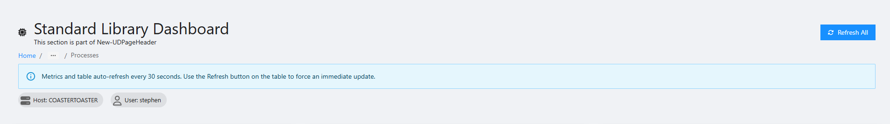
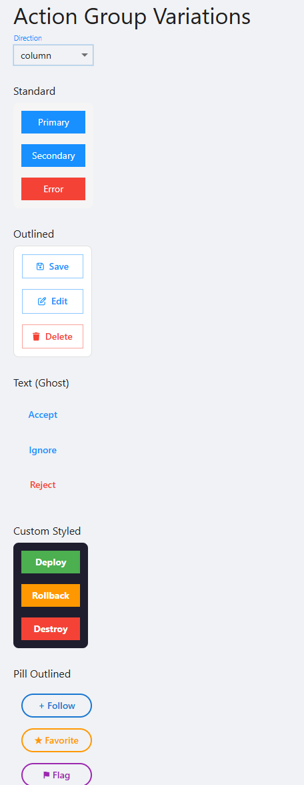
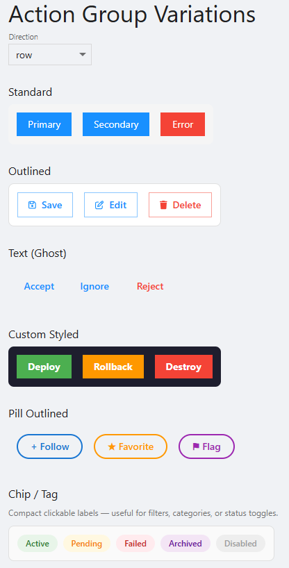
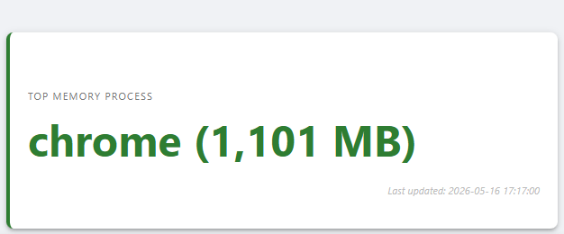
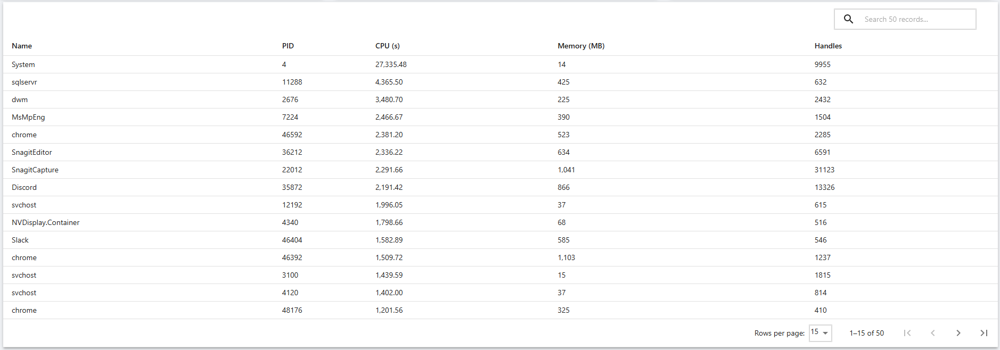
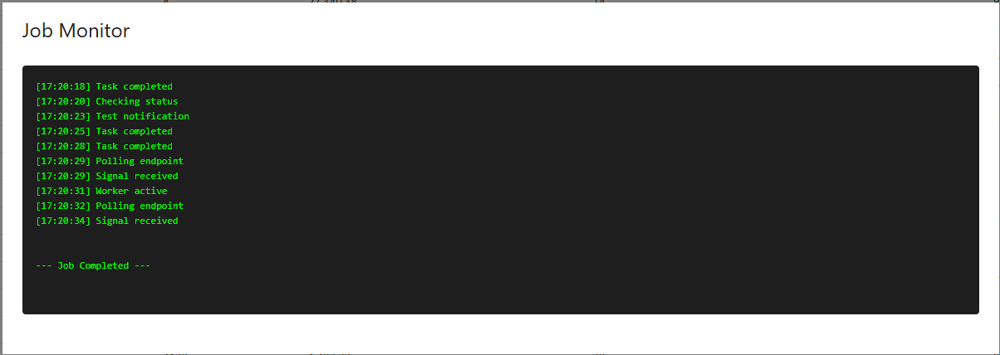
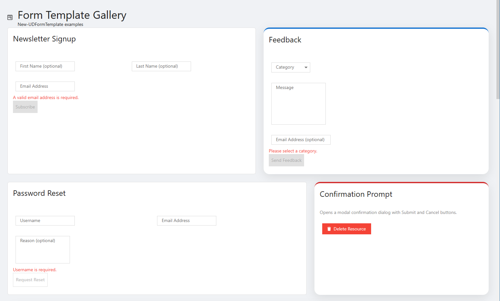
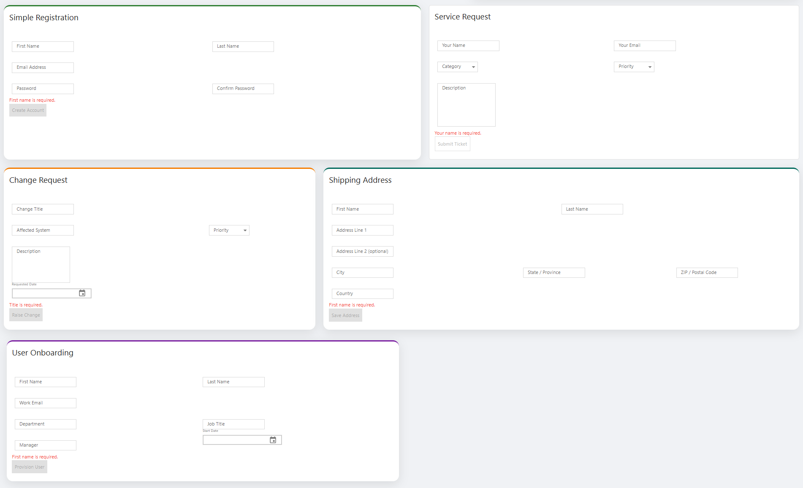

# PowerShellUniversal.StandardLibrary

A Standard Library of tools, utilities, and helper functions designed to streamline app development within the [PowerShell Universal](https://ironmansoftware.com/powershell-universal) platform.

## Overview

`PowerShellUniversal.StandardLibrary` provides a curated set of reusable PowerShell functions and components that simplify common tasks encountered when building dashboards, APIs, automations, and portals in PowerShell Universal. Instead of reinventing the wheel for every project, import this library and get started with a solid foundation of pre-built tools.

## Components

### `New-UDPageHeader`

A structured top-of-page header block. You can include any combination of a title, subtitle, icon, breadcrumb trail, help/info alert, metadata region, and an actions area on the right-hand side — all optional. The actions and metadata slots accept any PSU components, so you can drop in buttons, dropdowns, chips, or status badges wherever they make sense.



---

### `New-UDActionGroup`

Wraps a set of buttons in a flex stack with consistent spacing. The direction (`row`, `column`, `row-reverse`, `column-reverse`) and gap between buttons are both configurable, and the container shrinks to fit its content by default. Give the group an `-Id` and you can target it with `Sync-UDElement` to swap out its contents dynamically.

**Column layout**



**Row layout**



---

### `New-UDDataCard`

Renders a metric or status card built around a `-Value` script block. The value is evaluated inside a `New-UDDynamic` region, so it re-runs on every refresh without re-rendering the surrounding card. Supply `-RefreshInterval` to auto-refresh on a timer, or omit it and call `Sync-UDElement` against the card's `-Id` to refresh on demand. The value color and all card-level styles are fully overridable.



---

### `New-UDDynamicTable`

Combines `New-UDDynamic` and `New-UDTable` into a single call. Pass a `-Data` script block and a `-Columns` script block — both are re-executed on every refresh cycle. Built-in search, sorting, pagination, and a configurable page size are always enabled. Set `-RefreshInterval` for automatic polling, or leave it off and a **Refresh** button is rendered automatically.



---

### `Show-UDJobOutputModal`

Kicks off a PSU script job and opens a full-width modal that polls the job every two seconds, streaming its output into a terminal-style pane in real time. Once the job finishes a status line is appended and the modal closes on its own. Pass `-ScriptParameters` to forward arguments to the script, and use `-Style` to override any part of the output pane's appearance.



---

### `New-UDFormTemplate`

Renders a fully-wired `New-UDForm` from a named template, giving you pre-built input fields and field-level validation in a single call. Choose a template, provide an `-OnSubmit` handler, and optionally an `-OnCancel` — everything else is handled for you. Nine templates cover the most common data-entry scenarios:

| Template | Fields |
|---|---|
| `Email` | First name (opt), last name (opt), email address |
| `Feedback` | Category (select), message, email (opt) |
| `SimpleRegistration` | First name, last name, email, password, confirm password |
| `PasswordReset` | Username, email, reason (opt) |
| `ServiceRequest` | Requester name, email, category, priority, description |
| `ChangeRequest` | Title, affected system, priority, description, requested date |
| `UserOnboarding` | First/last name, work email, department, job title, manager, start date |
| `Shipping` | Name, address lines 1–2 (opt), city, state, ZIP, country |
| `Confirmation` | No fields — renders a proceed/cancel prompt |

The submit and cancel button labels, button variant (`contained`, `outlined`, `text`), CSS class, and an optional wrapping inline style are all independently configurable. Field IDs in `$EventData` are stable and documented so they can be referenced reliably in `-OnSubmit`.

**Flat and modern card styles — pairs 1 & 2**



**Remaining templates — pairs 3, 4, and 5**



---

## Installation

### From Within PowerShell Universal

1. Open your **PowerShell Universal** admin portal.
2. Navigate to **Platform** → **Modules**.
3. Search for `PowerShellUniversal.StandardLibrary` in the module repository.
4. Click **Install** and wait for the installation to complete.

Alternatively, you can install the module via the PowerShell Universal integrated terminal or a Script:

```powershell
Install-Module -Name PowerShellUniversal.StandardLibrary -Repository PSGallery -Force
```

### Importing the Module

Once installed, import the module in your scripts, dashboards, or API endpoints:

```powershell
Import-Module PowerShellUniversal.StandardLibrary
```

To make the module available globally across your PowerShell Universal instance, add it to your `environments` configuration or include it in your `scripts/settings.ps1` file.

## Usage

After importing the module, all exported functions will be available in your PowerShell Universal scripts and components. Refer to the individual function documentation (via `Get-Help <FunctionName>`) for details on available commands.

```powershell
# Example
Get-Command -Module PowerShellUniversal.StandardLibrary
```

## Examples

The [`EXAMPLES/`](EXAMPLES/) folder contains ready-to-run scripts that demonstrate each component. [Demo.ps1](EXAMPLES/Demo.ps1) is the best starting point — it covers every component on a single page with inline descriptions.

| File | Description |
|------|-------------|
| [Demo.ps1](EXAMPLES/Demo.ps1) | Kitchen-sink demo of all components on a single page with inline component descriptions. |
| [ActionGroup.ps1](EXAMPLES/ActionGroup.ps1) | Demonstrates `New-UDActionGroup` with four styling variations (standard, outlined, text/ghost, and custom) and a live direction selector. |
| [DynamicDataCard.ps1](EXAMPLES/DynamicDataCard.ps1) | Shows `New-UDDataCard` rendering live metric cards with auto-refresh and manual refresh patterns. |
| [DynamicTable.ps1](EXAMPLES/DynamicTable.ps1) | Shows `New-UDDynamicTable` with server-side data loading and row actions. |
| [JobModal.ps1](EXAMPLES/JobModal.ps1) | Demonstrates `Show-UDJobOutputModal` for surfacing job output inside a modal dialog. |
| [ContactForm.ps1](EXAMPLES/ContactForm.ps1) | Gallery of all nine `New-UDFormTemplate` templates with mixed flat and modern card styles. |

### Running Demo.ps1 in PowerShell Universal

1. **Install the module** (see [Installation](#installation) above) and ensure it is importable in your PSU environment.

2. **Open the Apps section** in the PowerShell Universal admin portal and click **Create App**.

3. **Fill in the app details:**
   - **Name** — any display name, e.g. `Standard Library Demo`
   - **URL** — the path the app will be served at, e.g. `/standardlibrary`
   - Leave all other settings at their defaults and click **Create**.

4. **Open the app editor.** From the Apps list, click the app you just created, then click **Edit** (or the pencil icon) to open the script editor.

5. **Paste the example code.** Open [EXAMPLES/Demo.ps1](EXAMPLES/Demo.ps1) from this repository, copy its entire contents, and paste them into the editor — replacing any existing placeholder code.

6. **Save and navigate** to the URL you set in step 3. The app will render immediately.

> **Tip:** If any components fail to render, confirm that `PowerShellUniversal.StandardLibrary` is available in the environment assigned to your app.

## Contributing

Contributions are welcome! If you have a utility or helper function that would benefit the PowerShell Universal community, feel free to get involved.

1. **Fork** this repository.
2. **Create a branch** for your feature or bug fix:
   ```bash
   git checkout -b feature/my-new-tool
   ```
3. **Commit** your changes with a clear and descriptive message:
   ```bash
   git commit -m "Add: utility function for X"
   ```
4. **Push** your branch and open a **Pull Request** against `main`.
5. Ensure your code follows existing conventions and includes appropriate documentation (`Get-Help` compatible comment blocks).

### Running the Test Harness

Before submitting a PR, run the included [Pester](https://pester.dev) test suite to validate code quality across all public functions. Pester 5.0 or later is required.

```powershell
# Install Pester if not already present
Install-Module -Name Pester -MinimumVersion 5.0.0 -Force

# Run all tests from the repository root
.\Invoke-Tests.ps1
```

Results are printed to the console and also written to `TestResults.xml` in NUnit format, which is compatible with CI systems such as GitHub Actions.

The test harness enforces:
- Comment-based help completeness (`.SYNOPSIS`, `.DESCRIPTION`, `.PARAMETER`, `.EXAMPLE`) on every exported function
- Naming convention compliance (`<Verb>-<Prefix><Noun>`)
- Structural requirements (no bare code outside functions in public files)
- Common PowerShell code smell checks

### Guidelines

- Keep functions focused and single-purpose.
- Include comment-based help (`<# .SYNOPSIS ... #>`) for every exported function.
- Add or update tests where applicable.
- Open an issue first for significant changes to discuss the approach before submitting a PR.

## License

This project is licensed under the [MIT License](LICENSE).
